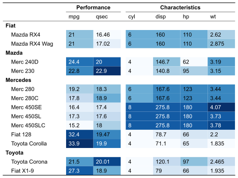

# typstable

The purpose of typstable /ˈtaɪps.tə.bᵊl/ is to produce publication-ready
tables for Quarto documents targeting the Typst format. Typst is a
modern, open-source, markup-based typesetting system that provides an
alternative to LaTeX for rendering PDF documents. This package allows R
users to create Typst tables with elaborate formatting.

## Installation

``` r
# Install from GitHub
pak::pak("freierson/typstable")
```

## Example

``` r
# Create table with data-driven styling
tbl <- tt(cars, cols = c(.rownames, all_of(style_cols))) |>
  tt_style(header_separate = TRUE) |>
  tt_header_above(c(" " = 1, "Performance" = 2, "Characteristics" = 4)) |>
  tt_column(mpg, color = color_mpg, background = bg_mpg) |>
  tt_column(qsec, color = color_qsec, background = bg_qsec) |>
  tt_column(cyl, color = color_cyl, background = bg_cyl) |>
  tt_column(disp, color = color_disp, background = bg_disp) |>
  tt_column(hp, color = color_hp, background = bg_hp) |>
  tt_column(wt, color = color_wt, background = bg_wt) |>
  tt_pack_rows(index = group_idx) |>
  tt_column(1, width = "20%")
```



## Learn more

See the [Get
started](https://freierson.github.io/typstable/articles/typstable.html)
vignette for full documentation.
