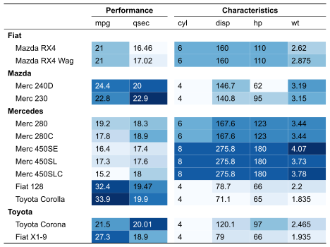

# typstable 

<div id="badges">

[](https://github.com/freierson/typstable/actions/workflows/R-CMD-check.yaml)
[](https://app.codecov.io/gh/freierson/typstable)
[](https://lifecycle.r-lib.org/articles/stages.html#experimental)
[](https://cran.r-project.org/package=typstable)
[](https://cran.r-project.org/package=typstable)

</div>

The purpose of typstable /ˈtaɪps.tə.bᵊl/ is to produce publication-ready
tables for Quarto documents targeting the Typst format. Typst is a
modern, open-source, markup-based typesetting system that provides an
alternative to LaTeX for rendering PDF documents. This package allows R
users to create Typst tables with elaborate formatting.

## Installation

``` r
install.packages("typstable")
```

## Example

``` r
# Create table with data-driven styling
tbl <- tt(cars, cols = c(.rownames, all_of(style_cols)), preamble='#set text(font: "Arial")') |>
  tt_header_above(c(" " = 1, "Performance" = 2, "Characteristics" = 4)) |>
  tt_column(-1, color = "color_{col}", fill = "bg_{col}") |>
  tt_pack_rows(index = table(cars$brand)) |>
  tt_column(1, width = "25%")
```


